SkillTest application.

A project description:
A testing bank for recruiters to evaluate candidate skills.

Who uses it?
Recruiters are primary users, Candidates are secondary users
Perfect for employee testing or pre-employment testing for candidate screening, pre-training testing and post-training testing, certification programs or workforce planning.

What outputs do they need?
Total candidate score from testing.

What inputs are needed to generate those outputs?
Recruiter creates a questions for candidate.
Candidate answer a questions.

A list of technologies that you plan to use
HTML, CSS, JavaScript, EJS, Node.js, Express, PostgreSQL

Features:
When recruiter visits page, they are directed to a register/login page
Recruiter can create account and log in
Recruiter can create a test
When a test is created, the recruiter received a unique test id to send to the candidate with password that can be randomly generated
Tests can be re-used by indicating a candidate in the url or password
Recruiter received detailed results for completed tests with graphs
When candidate visits unique url, they are prompted to enter password created for the test by the recruiter
Tests prompt different difficulty levels of question based on whether or not the candidate got the last questions correct
Test responses are timed

DB Shchema:
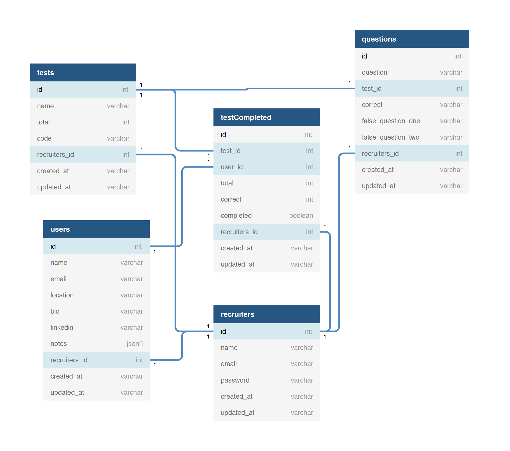

### APP

Home:
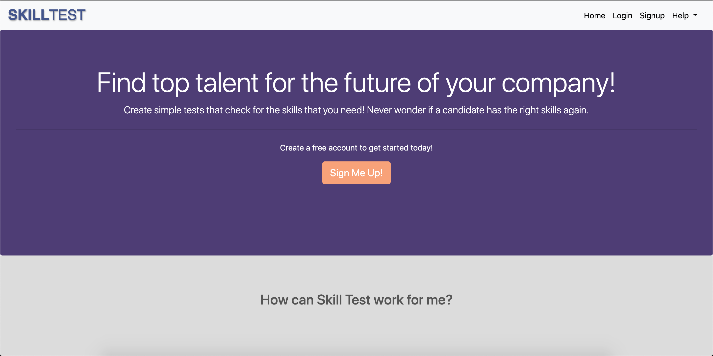
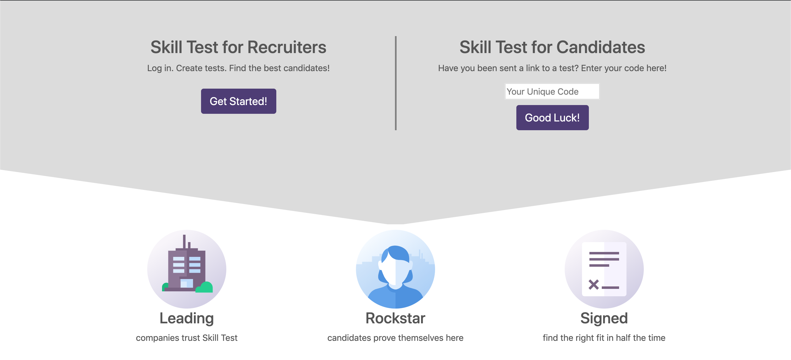
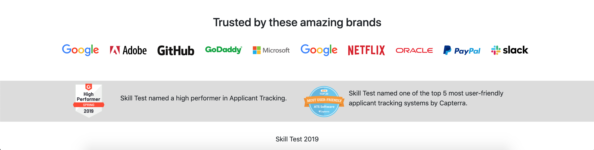

Login:
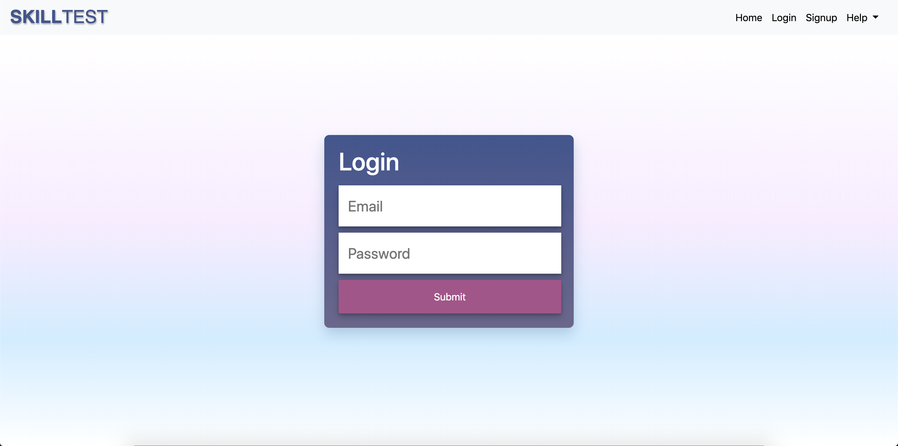

Register:
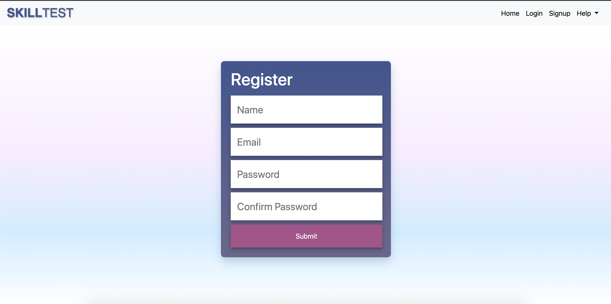

Home Recruiter:
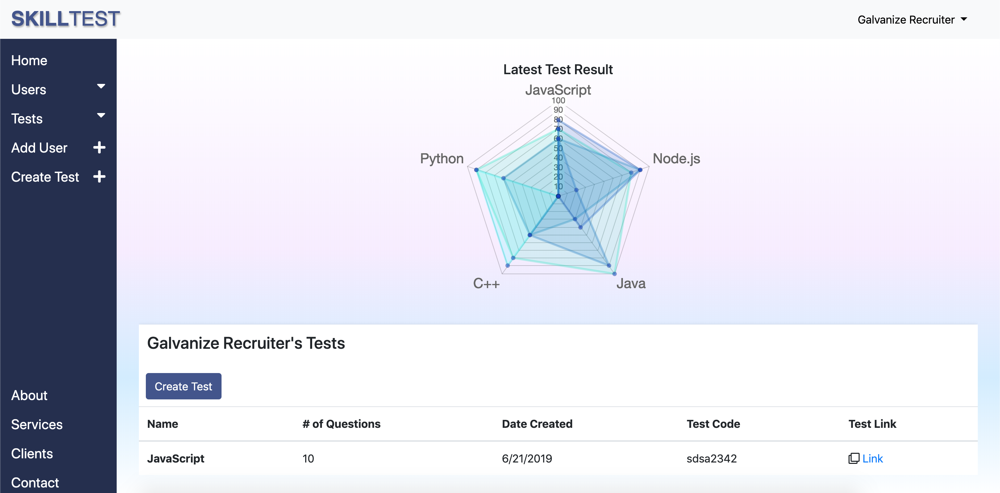
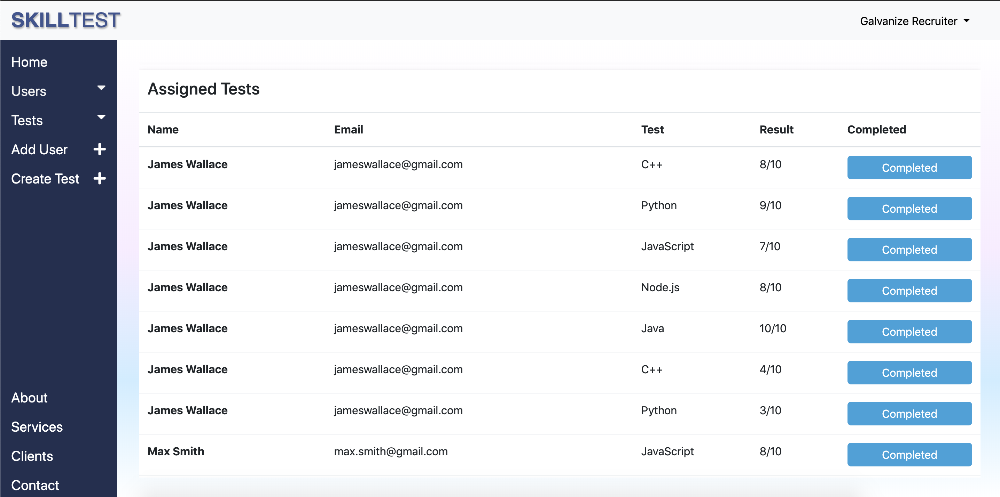

Recruiters Client:
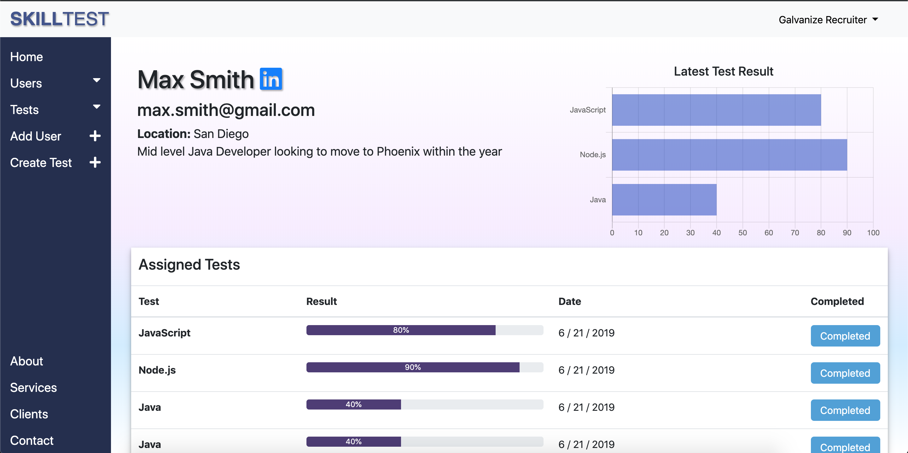
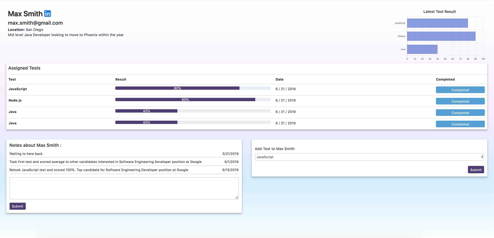

Recruiters Tests:
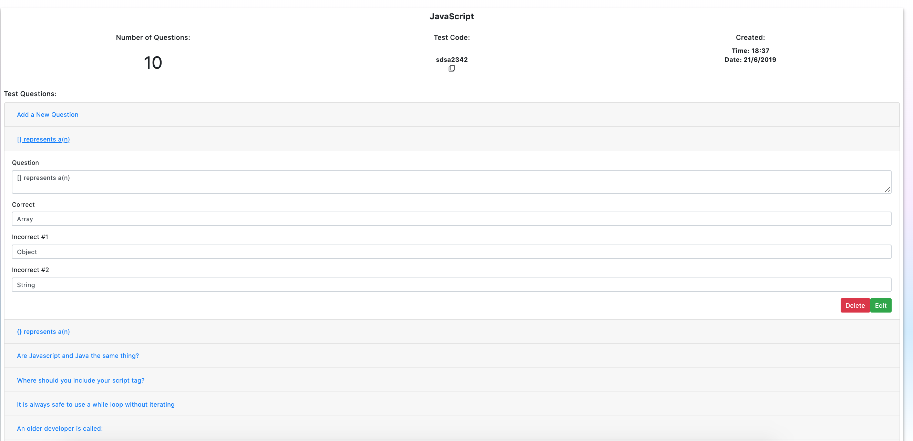

Add a Client by Recruiter:
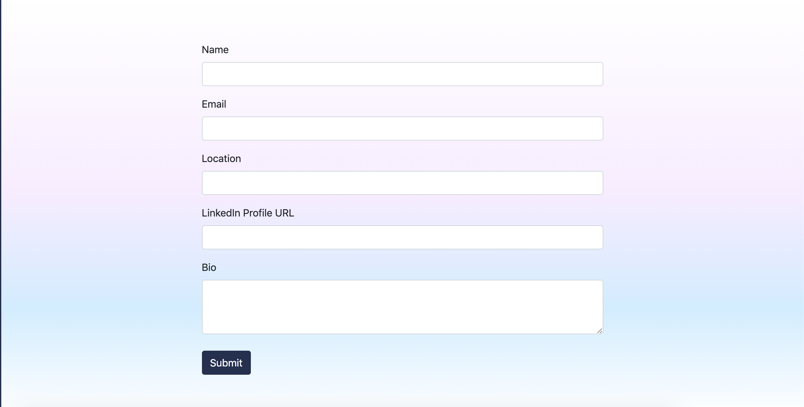

Create a Test by Recruiter:
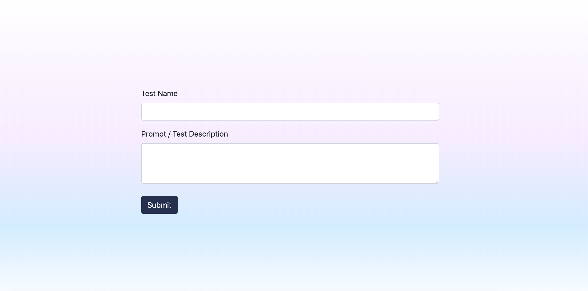

Recruiter Acc Settings:
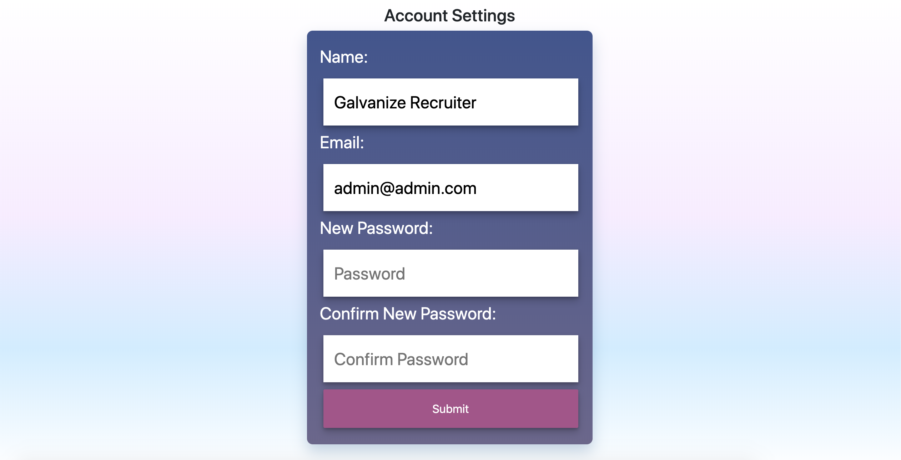

Test by Recruiters Client - Login:
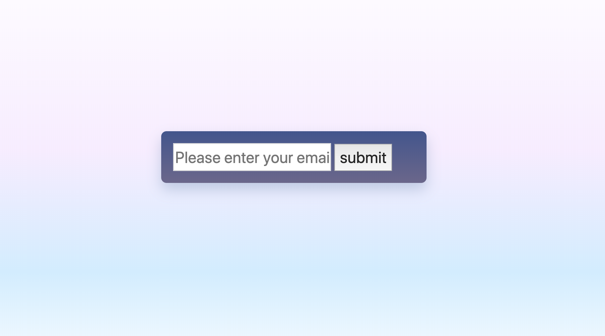
Test by Recruiters Client - Questions:
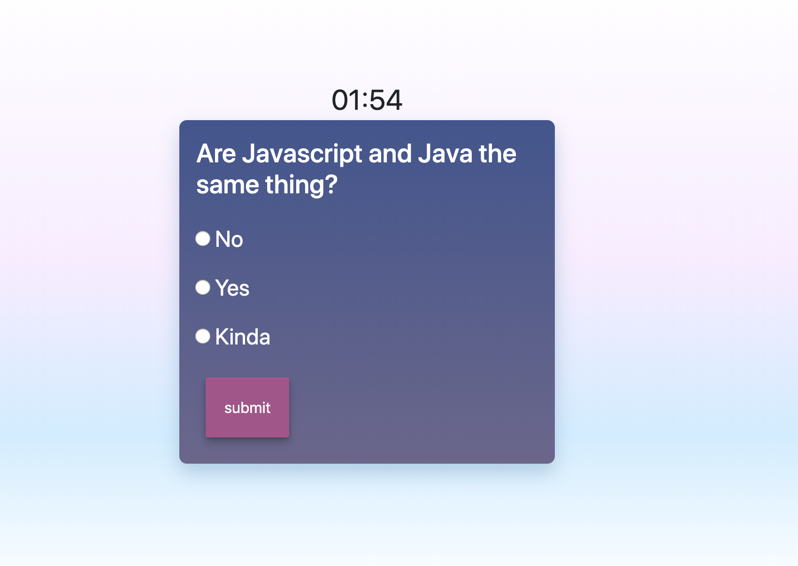
